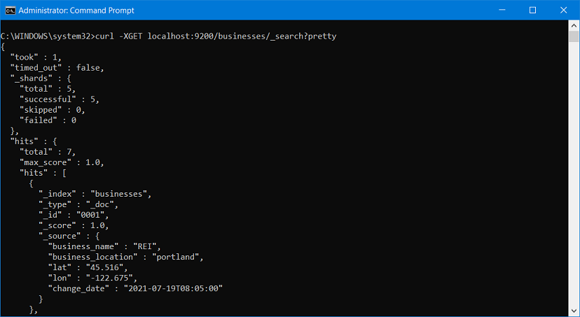

# elastic-search-dev01
poc api project for using NEST and ElasticSearch - c# and .NetCore

# ElasticSearchNetCorePOC

This repo contains the source code to demonstrate how to integrate a C# API-application together with an elastic-search service, using NEST and custom queries.
Basic Search features include creating an Index, searching for keywords, as well as doing advanced searches.


## Execute the sample

```sh

dotnet ElasticSearchTest.dll create -f businesses.txt -h https://localhost:9200
> Index created in 2338ms with 140 element.

dotnet ElasticSearchTest.dll search -i businesses -h https://localhost:9200 -q "REI AND nwa"
> Searching for $REI AND nwa*

```


Screen-shot of sample curl command in cmd-window :



## Quick Start Examples

1. Create a class to define valid options, and to receive the parsed options.
2. Call ParseArguments with the args string array.

C# Quick Start:

```cs
using System;
using CommandLine;

namespace QuickStart
{
    class Program
    {
        public class Options
        {
            [Option('v', "verbose", Required = false, HelpText = "Set output to verbose messages.")]
            public bool Verbose { get; set; }
        }

        static void Main(string[] args)
        {
            Parser.Default.ParseArguments<Options>(args)
                   .WithParsed<Options>(o =>
                   {
                       if (o.Verbose)
                       {
                           Console.WriteLine($"Verbose output enabled. Current Arguments: -v {o.Verbose}");
                           Console.WriteLine("Quick Start Example! App is in Verbose mode!");
                       }
                       else
                       {
                           Console.WriteLine($"Current Arguments: -v {o.Verbose}");
                           Console.WriteLine("Quick Start Example!");
                       }
                   });
        }
    }
}
```

## C# Examples:

<details>
  <summary>Click to expand!</summary>

```cs

class Options
{
  [Option('r', "read", Required = true, HelpText = "Input files to be processed.")]
  public IEnumerable<string> InputFiles { get; set; }

  // Omitting long name, defaults to name of property, ie "--verbose"
  [Option(
	Default = false,
	HelpText = "Prints all messages to standard output.")]
  public bool Verbose { get; set; }
  
  [Option("stdin",
	Default = false,
	HelpText = "Read from stdin")]
  public bool stdin { get; set; }

  [Value(0, MetaName = "offset", HelpText = "File offset.")]
  public long? Offset { get; set; }
}

static void Main(string[] args)
{
  CommandLine.Parser.Default.ParseArguments<Options>(args)
    .WithParsed(RunOptions)
    .WithNotParsed(HandleParseError);
}
static void RunOptions(Options opts)
{
  //handle options
}
static void HandleParseError(IEnumerable<Error> errs)
{
  //handle errors
}

```

</details>
